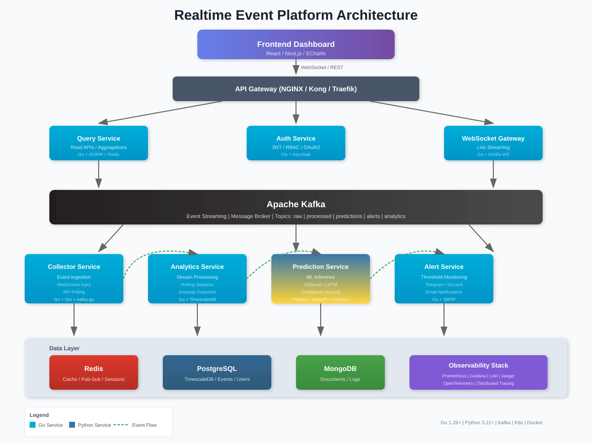
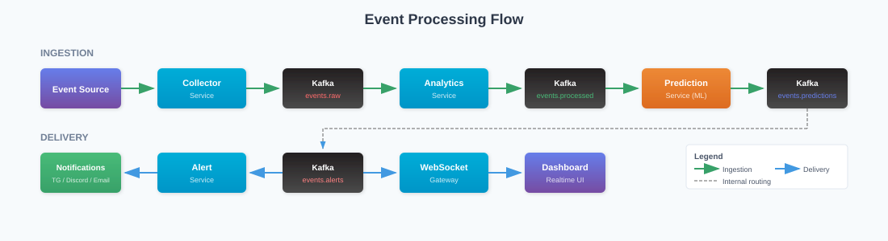

<div align="center">

# Realtime Event Platform

### Enterprise-Grade Event Streaming & AI-Powered Analytics Platform

[](https://golang.org/)
[](https://python.org/)
[](https://kafka.apache.org/)
[](https://kubernetes.io/)
[](LICENSE)

**A high-performance, distributed microservices platform for real-time event ingestion, stream processing, AI-powered predictions, and anomaly detection at scale.**

[Features](#-features) | [Architecture](#-architecture) | [Quick Start](#-quick-start) | [Documentation](#-documentation)

---

</div>

## Overview

**Realtime Event Platform** is a production-ready distributed system designed for:

- **Continuous Event Ingestion** - High-throughput data collection from multiple sources
- **Real-time Stream Processing** - Sub-millisecond event processing with Kafka
- **Statistical Analytics** - Rolling statistics, probability analysis, trend detection
- **AI/ML Predictions** - Trend forecasting and confidence scoring with XGBoost & LSTM
- **Anomaly Detection** - Real-time outlier identification with Isolation Forest
- **Live Dashboard** - WebSocket-powered real-time visualization

Built with **distributed systems principles**, **event-driven architecture**, and **cloud-native best practices**.

---

## Features

### Event-Driven Architecture
- Kafka-based event streaming
- Async message processing
- Event sourcing patterns
- Guaranteed delivery with retries

### Real-time Analytics
- Rolling probability analysis
- Streak detection algorithms
- Entropy & distribution analysis
- Moving averages & aggregations

### AI/ML Pipeline
- XGBoost trend predictions
- Isolation Forest anomaly detection
- LSTM time-series forecasting
- Confidence scoring & calibration

### High Performance
- Go-powered microservices
- Worker pool concurrency
- Connection pooling
- Optimized query patterns

### Enterprise Security
- JWT authentication
- Role-based access control (RBAC)
- OAuth2 / Keycloak integration
- API key management

### Real-time Delivery
- WebSocket live streaming
- Pub/Sub broadcasting
- Multi-channel alerts (Telegram, Discord, Email)

---

## Architecture

<div align="center">
  
</div>

### Event Flow

<div align="center">
  
</div>

<details>
<summary>ASCII Diagram (click to expand)</summary>

```
                         +-------------------------------------------------------------+
                         |                    Frontend Dashboard                        |
                         |               (React / Next.js / ECharts)                   |
                         +----------------------------+--------------------------------+
                                                      |
                                             WebSocket / REST API
                                                      |
                         +----------------------------v--------------------------------+
                         |                      API Gateway                             |
                         |                  (NGINX / Kong / Traefik)                    |
                         +--------+-----------------+-----------------+----------------+
                                  |                 |                 |
               +-----------------+v------+   +------v------+   +------v-----------------+
               |      Query Service      |   |    Auth     |   |   WebSocket Gateway    |
               |     (Read APIs, Agg)    |   |   Service   |   |   (Live Streaming)     |
               +-----------------+-------+   +-------------+   +-------------+----------+
                                 |                                           |
                                 +-------------------+-----------------------+
                                                     |
                         +---------------------------v-----------------------------+
                         |                                                          |
                         |                    Apache Kafka                          |
                         |         (Event Streaming / Message Broker)               |
                         |                                                          |
                         +-------+------------------+------------------+------------+
                                 |                  |                  |
               +-----------------v----+  +---------v---------+  +-----v----------------+
               |  Collector Service   |  | Analytics Service |  |  Prediction Service  |
               +-----------------+----+  +---------+---------+  +-----+----------------+
                                 |                 |                  |
                                 +-----------------+------------------+
                                                   |
               +-----------------------------------+-----------------------------------+
               |    +-----------+    +-------------v-----------+    +-------------+   |
               |    |  Redis    |    |       PostgreSQL        |    |   MongoDB   |   |
               |    |  (Cache)  |    |   (TimescaleDB Ready)   |    |  (Documents)|   |
               |    +-----------+    +-------------------------+    +-------------+   |
               +-----------------------------------------------------------------------+
```

### Event Flow

```
+----------+    +-------------+    +---------------+    +----------------+    +-----------+
|  Event   |--->|  Collector  |--->|  Kafka Topic  |--->|   Analytics    |--->| Prediction|
|  Source  |    |   Service   |    |  (raw-events) |    |    Service     |    |  Service  |
+----------+    +-------------+    +---------------+    +----------------+    +-----+-----+
                                                                                     |
+----------+    +-------------+    +---------------+    +----------------+           |
| Frontend |<---|  WebSocket  |<---|  Kafka Topic  |<---|  Alert Service |<----------+
| Dashboard|    |   Gateway   |    | (alert-events)|    |   (Anomalies)  |
+----------+    +-------------+    +---------------+    +----------------+
```

</details>
---

## Services

| Service | Language | Description | Key Technologies |
|---------|----------|-------------|------------------|
| **Collector Service** | Go | High-throughput event ingestion, validation, and routing | Gin, kafka-go, goroutines |
| **Analytics Service** | Go | Real-time stream processing, statistical analysis | Kafka consumer, TimescaleDB |
| **Prediction Service** | Python | ML inference, trend prediction, anomaly scoring | FastAPI, XGBoost, PyTorch |
| **WebSocket Gateway** | Go | Live data push, connection management, pub/sub | Gorilla WebSocket, Redis Pub/Sub |
| **Query Service** | Go | Optimized read APIs, dashboard aggregations | GORM, Redis cache |
| **Auth Service** | Go | JWT auth, RBAC, OAuth2, API key management | JWT, Keycloak |
| **Alert Service** | Go | Threshold monitoring, multi-channel notifications | Telegram, Discord, SMTP |

---

## Kafka Topics

| Topic | Purpose | Producers | Consumers |
|-------|---------|-----------|-----------|
| `events.raw` | Raw ingested events | Collector | Analytics |
| `events.processed` | Enriched & validated events | Analytics | Query, Prediction |
| `events.predictions` | ML prediction results | Prediction | WebSocket, Alert |
| `events.alerts` | Anomaly & threshold alerts | Alert | WebSocket, Notification |
| `events.analytics` | Aggregated metrics | Analytics | Query, Dashboard |

---

## Tech Stack

### Backend
- Go (Gin framework)
- Python (FastAPI)
- gRPC / REST

### Streaming & Cache
- Apache Kafka
- Redis

### Database
- PostgreSQL (TimescaleDB)
- MongoDB

### AI/ML
- PyTorch
- XGBoost
- scikit-learn

### DevOps & Observability
- Docker & Kubernetes
- Prometheus & Grafana
- Loki & Jaeger
- OpenTelemetry

---

## Quick Start

### Prerequisites

- Go 1.26+
- Docker & Docker Compose
- Make (optional)

### 1. Clone & Setup

```bash
git clone https://github.com/huynguyenjv/realtime-event-platform.git
cd realtime-event-platform

# Copy environment file
cp .env.example .env
```

### 2. Start Infrastructure

```bash
# Start Kafka, PostgreSQL, Redis, MongoDB
make infra-up

# Create Kafka topics
./scripts/create-topics.sh

# Run database migrations
make migrate-up
```

### 3. Start Services

```bash
# Start all services with Docker
make docker-up

# Or run individual service locally
make run-collector-service
```

### 4. Verify

```bash
# Check service health
curl http://localhost:8081/health  # Collector
curl http://localhost:8082/health  # Analytics
curl http://localhost:8086/health  # Auth

# View logs
make docker-logs
```

---

## Project Structure

```
realtime-event-platform/
|
+-- services/                      # Microservices
|   +-- collector-service/         # Event ingestion
|   +-- analytics-service/         # Stream processing
|   +-- prediction-service/        # ML inference
|   +-- websocket-gateway/         # Live streaming
|   +-- query-service/             # Read APIs
|   +-- auth-service/              # Authentication
|   +-- alert-service/             # Notifications
|
+-- shared/                        # Shared code
|   +-- proto/                     # Protobuf definitions
|   +-- contracts/                 # Shared types
|   +-- libs/                      # Common libraries
|
+-- infra/                         # Infrastructure
|   +-- docker/                    # Docker Compose
|   +-- k8s/                       # Kubernetes manifests
|   +-- monitoring/                # Prometheus, Grafana
|   +-- postgres/                  # Migrations
|   +-- gateway/                   # API Gateway config
|
+-- scripts/                       # Utility scripts
+-- docs/                          # Documentation
+-- Makefile                       # Build commands
+-- go.work                        # Go workspace
```

---

## Technical Highlights

### Distributed Systems Patterns

| Pattern | Implementation |
|---------|----------------|
| **Event Sourcing** | Kafka topic as event log |
| **CQRS** | Separate read (Query) and write (Collector) services |
| **Saga Pattern** | Distributed transaction coordination |
| **Circuit Breaker** | Fault tolerance for external calls |
| **Retry with Backoff** | Exponential backoff for transient failures |
| **Idempotency** | Deduplication keys for exactly-once processing |

### Performance Optimizations

- **Worker Pool** - Bounded concurrency with goroutine pools
- **Connection Pooling** - Reusable DB & Redis connections
- **Batch Processing** - Bulk inserts and Kafka batch writes
- **Caching** - Redis cache with TTL for hot data
- **Query Optimization** - Indexed queries, materialized views

### Production-Grade Features

- Structured JSON logging with correlation IDs
- Prometheus metrics for all services
- Distributed tracing with OpenTelemetry
- Health checks & readiness probes
- Graceful shutdown handling
- Rate limiting & throttling
- Request validation & sanitization

---

## Monitoring

### Grafana Dashboards

| Dashboard | Metrics |
|-----------|---------|
| **System Overview** | Request rate, latency, error rate |
| **Kafka Metrics** | Consumer lag, throughput, partitions |
| **Service Health** | CPU, memory, goroutines |
| **Business Metrics** | Events processed, predictions made |

### Alerting

Configured alerts for:
- High error rate (> 1%)
- Kafka consumer lag (> 10,000)
- Service response time (p99 > 500ms)
- Memory usage (> 80%)

---

## Roadmap

- [ ] Online learning / model retraining
- [ ] CQRS with Event Sourcing
- [ ] Service mesh (Istio)
- [ ] Multi-tenant SaaS mode
- [ ] Distributed ML inference
- [ ] Horizontal pod autoscaling
- [ ] Real-time AI agents
- [ ] GraphQL API layer

---

## Learning Objectives

This project demonstrates practical experience with:

| Domain | Skills |
|--------|--------|
| **Backend** | Go, Python, REST, gRPC, WebSocket |
| **Architecture** | Microservices, Event-Driven, DDD |
| **Data** | Kafka streaming, time-series, caching |
| **AI/ML** | Inference pipelines, model serving |
| **DevOps** | Docker, K8s, CI/CD, monitoring |
| **Distributed Systems** | Consistency, fault tolerance, scaling |

---

## Contributing

Contributions are welcome! Please read our [Contributing Guide](CONTRIBUTING.md) for details.

---

## License

This project is licensed under the MIT License - see the [LICENSE](LICENSE) file for details.

---

<div align="center">

**Built for learning distributed systems and real-time AI**

</div>
